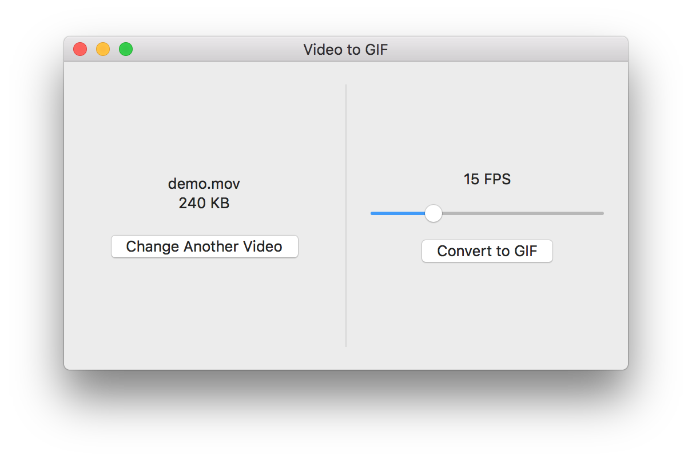

# VideoToGIF

## Description
`VideoToGIF` is a simple Mac app to convert videos to GIF. Useful for quickly create a demo for your open source project or app. 

The project is written in Swift 3.0 and uses [Regift](https://github.com/matthewpalmer/Regift) to convert videos to GIF.

## Installation
Run the project yourself with Xcode 8 or just grab the application from the [releases](https://github.com/BalestraPatrick/VideoToGIF/releases) page.

## Author

I'm [Patrick Balestra](http://www.patrickbalestra.com).
Email: [me@patrickbalestra.com](mailto:me@patrickbalestra.com)
Twitter: [@BalestraPatrick](http://twitter.com/BalestraPatrick).

## License

`VideoToGIF` is available under the MIT license. See the [LICENSE](LICENSE) file for more info.